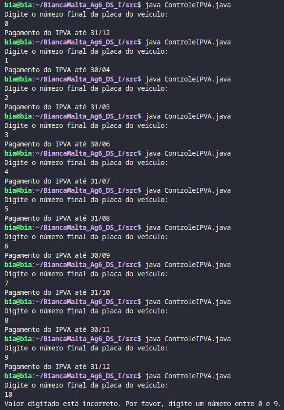

# Controle IPVA
## Exercício

O escritório de Despachante Vale Card é uma empresa especializada em documentação de veículos atuando diretamente com os órgãos de trânsito. Entre suas atividades, está informar para seus clientes o mês de vencimento do IPVA de seus veículos. Para isso, o cliente fornece o número final da placa do veículo, em seguida deve ser apresentado o mês que o IPVA deve ser pago, conforme tabela a seguir:

 
| Placa| Vencimento|
| ----- | ---- |
| Final 1 | 30/04 |
| Final 2 | 31/05 |
| Final 3 | 30/06 |
| Final 4 | 31/07 |
| Final 5 | 31/08 |
| Final 6 | 30/09 |
| Final 7 | 31/10 |
| Final 8 | 30/11 |
| Final 9 ou 0 | 31/12 |

Elabore um programa em linguagem Java que receba o número final da placa do veículo, e exiba uma mensagem informando o período que o cliente tem para pagamento do IPVA. Caso a placa informada esteja fora da faixa entre 0 e 09, o programa deverá exibir uma mensagem informando o valor digitado está incorreto.
## Execução
Para realizar a atividade proposta, segui os seguintes passos:

**1. Importei a classe Scanner** 

No início do código, importei a classe `Scanner` do pacote `java.util`, a qual é necessária para permitir a leitura de entrada do usuário a partir do console.

**2. Defini a classe principal**

Designei uma classe `ControleIPVA` com o método `main`, sendo o ponto de entrada do programa Java.

**3. Criei um objeto Scanner**

Dentro do método main, defini um objeto da `classe Scanner` como `scanner`, que será encerrado pelo método `close()`, após todo o bloco de código ser executado.

**4. Solicitei o número final da placa do veículo**

O programa exibe uma mensagem pedindo ao usuário que insira o número final da placa.
- Leitura

O objeto `scanner` lê o número fornecido através do método `nextInt()` e armazena esse valor na variável `finalPlaca`.

- Verificação

É feita uma verificação para garantir que o número esteja entre 0 e 9. Se estiver dentro dessa faixa, a aplicação continua; caso contrário, uma mensagem de erro é exibida.

**5. Informei o mês de vencimento do IPVA**

Usando uma estrutura de controle `switch`, determinei o mês de vencimento do IPVA. Cada caso corresponde a um número final da placa e exibe a mensagem correspondente ao período de pagamento.

## Estrutura de Controle

Como visto acima, desenvolvi o raciocínio de resolução utilizando `switch`, `case` e `break`,  elementos fundamentais em linguagens de programação, para criar estruturas de controle de fluxo mais complexas e organizadas. Em um breve resumo, eles são empregadas nas seguintes condições:

**Switch**

É útil quando há uma grande variedade de possíveis valores para uma variável e desejamos rodar diferentes blocos de código a dependendo do valor.

**Case**

O case é uma ramificação dentro de um bloco switch que especifica uma condição; houvendo correspondência, o bloco de código associado ao case é executado.

**Break**

O break é a instrução usada para sair do bloco switch após um case ser processado, evitando a execução dos próximos case.

Portanto, o `switch` define a expressão a ser avaliada, os `case` especificam as condições a serem verificadas e o `break` é usado para encerrar a execução após um case ser correspondido.

## Autora
