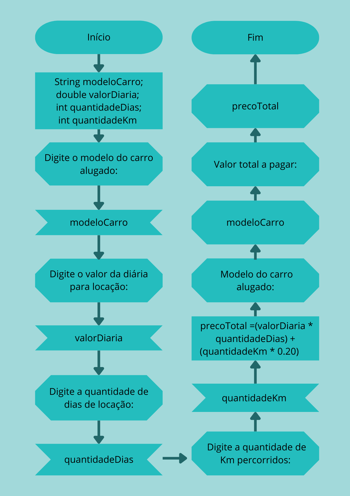

# SPCar

## Exercício
Foi solicitado a criação de uma aplicação em `Java` para auxiliar a cobrança de serviços de locação de veículos. O programa deveria ler os seguintes dados:
1. modelo do carro alugado;

2. valor da diária para locação;

3. quantidade de dias de locação;

4. quantidade de km percorridos.

Por último, a aplicação teria que exibir na tela o modelo do carro e o valor total a ser pago pelo usuário, levando em conta que seria cobrado R$ 0,20 por km rodado.

## Execução
Para realizar essa tarefa, utilizei a IDE `Visual Studio Code`, o que exigiu a instalação de algumas extensões presentes em `Extension Pack for Java`. Além disso, foi necessário instalar `Java Development Kit`, que consiste em um conjunto de programas que engloba compilador, interpretador e utilitários, fornecendo um pacote de ferramentas básicas para o desenvolvimento de aplicações Java. Por fim, através da ferramenta `Canvas`, desenvolvi o fluxograma solicitado e anexei a essa pasta.

## Autora

