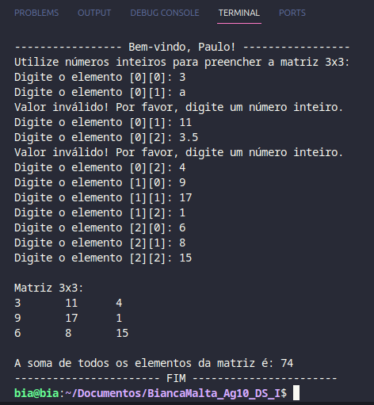

# Soma Matriz

## Exercício
Paulo, o estudante do Ensino Médio que você conheceu no Mergulhando no Tema, agora deseja criar um programa que realize a soma de todos os elementos de uma matriz 3x3, contendo números inteiros. Elabore a codificação em linguagem Java de um software que resolva o problema de Paulo.

**IMPORTANTE: O programa deverá solicitar a digitação dos valores e armazenar numa matriz 3x3.**
## Execução
Para realizar essa tarefa, segui as seguintes etapas:

### Inicialização 
No início do programa, declarei uma matriz 3x3 (array bidimensional) para armazenar os dados fornecidos pelo usuário. 

### Entrada de Dados
Utilizei dois loops aninhados e, dentro desses loops, pedi ao usuário que inserisse um número inteiro para cada posição da matriz. Visando garantir esse requisito, coloquei um loop while para verificar se a entrada é valida. Se não for, uma mensagem de erro é exibida e um novo valor é solicitado.

### Cálculo da Soma
Após preencher a matriz com os dados fornecidos pelo usuário, percorro novamente cada elemento usando loops aninhados e somo seus valores. 

### Exibição da Matriz e da Soma
Por fim, é mostrada a matriz linha por linha e o resultado do cálculo efetuado.

## Autora
