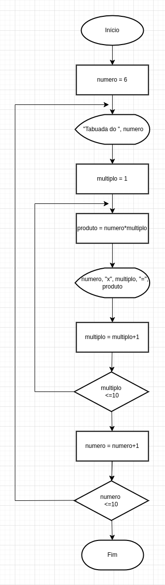

# Tabuada

## Exercício

Giovanna adora usar computador, navegar na internet e matemática. Ela decidiu estudar tabuada devido a sua dificuldade durante o período de aula (ela apenas sabe as tabuadas dos números 0 até 05).

Ao navegar na internet, aprendeu a desenvolver alguns algoritmos e decidiu desenvolver algo para ajudá-la em seus estudos com tabuada.

Escreva para Giovanna um Fluxograma e um Programa em Java da Tabuada dos números 6 até 10.

## Execução

O processo de criação do código consistiu em:

**1. Estruturação:**

O programa é estruturado em uma classe chamada `Tabuada`, que contém o método `main`, ponto de entrada do programa `Java`.

**2. Loop Externo:**

Utilizei um loop `for` para iterar sobre os números de 6 a 10. A variável `numero` representa o número atual em cada iteração.

**3. Loop Interno:**

Dentro do loop externo, utilizei outro loop `for` para iterar sobre os múltiplos de 1 a 10. A variável `multiplo` representa o múltiplo atual em cada iteração.

- Cálculo do Produto:

Dentro do loop interno, calculei o produto do número atual (`numero`) com o múltiplo atual (`multiplo`) e armazenei esse produto na variável `produto`.

- Exibição do Produto:

Exibi o produto calculado na etapa anterior utilizando `System.out.println()` para imprimir na saída padrão.

**4. Finalização do Loop Interno:**

Após calcular e exibir os produtos para todos os múltiplos de 1 a 10, o loop interno é concluído.

**5. Finalização do Loop Externo:**

Após iterar sobre todos os números de 6 a 10 e imprimir suas respectivas tabuadas, o loop externo é concluído.

**6. Fim do Programa:**

O programa termina após executar todas as instruções dentro do método main.
 
 
 
 
 
 
 
 

## Autora

